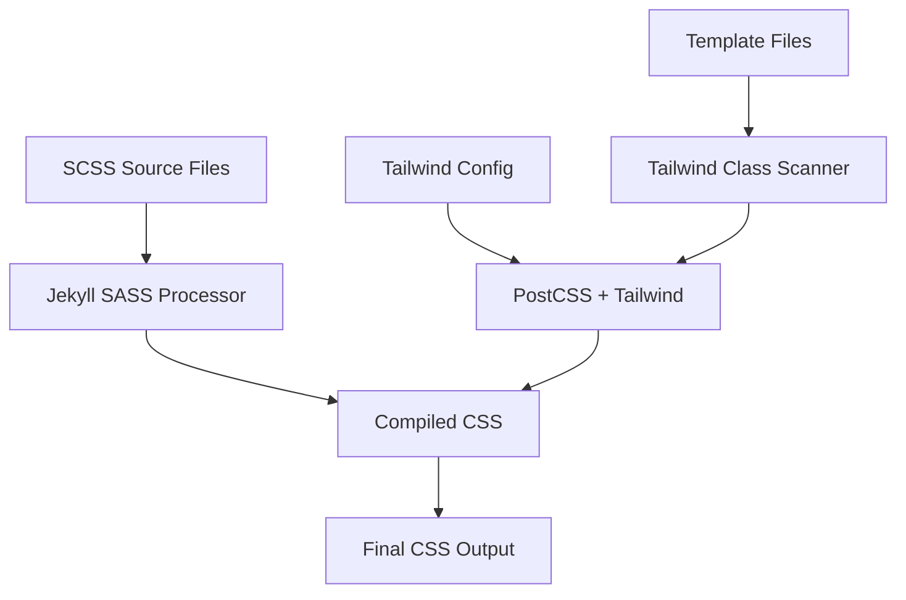

# Design Document: Tailwind CSS and SCSS Integration

## Overview

This design integrates Tailwind CSS utility framework and SCSS preprocessing into the existing Jekyll site while maintaining compatibility with the Minima theme and GitHub Pages deployment. The solution uses Jekyll's native SASS/SCSS support combined with a GitHub Pages-compatible approach for Tailwind processing, creating a unified CSS pipeline that supports both utility classes and custom SCSS styling without requiring Node.js build processes.

## Architecture

### Build Pipeline Flow



### Integration Strategy

The design uses a GitHub Pages-compatible approach:
1. **Jekyll's native SASS/SCSS processing** for custom styles and theme compatibility
2. **Pre-built Tailwind CSS** via CDN or committed compiled CSS for GitHub Pages compatibility
3. **GitHub Actions workflow** for advanced Tailwind processing with purging and optimization
4. **Fallback strategy** ensuring the site works both locally and on GitHub Pages

## Components and Interfaces

### 1. SCSS Architecture

**File Structure:**
```
assets/
├── css/
│   └── main.scss          # Main SCSS entry point
├── scss/
│   ├── _variables.scss    # Custom variables
│   ├── _components.scss   # Custom components
│   ├── _utilities.scss    # Custom utilities
│   └── _tailwind.scss     # Tailwind imports
```

**Main SCSS Entry Point (`assets/css/main.scss`):**
- Imports Tailwind base, components, and utilities
- Imports custom SCSS partials
- Maintains Minima theme compatibility
- Provides override capabilities

### 2. Tailwind Configuration

**Configuration File (`tailwind.config.js`):**
- Content scanning for Jekyll templates (`_layouts/`, `_includes/`, `_posts/`, `*.html`, `*.md`)
- Custom theme extensions
- Plugin configurations
- Purge settings for production optimization

**GitHub Pages Deployment Strategy:**
- **Option A**: Use Tailwind CDN for immediate compatibility
- **Option B**: GitHub Actions workflow to build and deploy with full Tailwind processing
- **Option C**: Commit pre-built Tailwind CSS to repository for GitHub Pages

### 3. Build Integration

**Jekyll Configuration Updates (`_config.yml`):**
- SASS configuration for proper source maps
- Plugin additions for enhanced CSS processing
- Exclude patterns for build optimization

**Gemfile Dependencies (GitHub Pages Compatible):**
- Maintain existing Jekyll and Minima versions
- Add only GitHub Pages-approved plugins
- Avoid Node.js dependencies that aren't supported by GitHub Pages

### 4. Development Workflow

**Development and Deployment Workflows:**
- **Local Development**: Optional Node.js setup for full Tailwind features
- **GitHub Actions**: Automated build and deployment with Tailwind processing
- **GitHub Pages**: Direct deployment using pre-built or CDN-based Tailwind

## Data Models

### CSS Processing Pipeline

```typescript
interface CSSPipeline {
  sources: {
    scss: string[];        // SCSS source files
    tailwind: string;      // Tailwind config
    templates: string[];   // Template files for scanning
  };
  processors: {
    sass: SassProcessor;
    postcss: PostCSSProcessor;
    tailwind: TailwindProcessor;
  };
  output: {
    development: string;   // Unminified CSS with source maps
    production: string;    // Minified, purged CSS
  };
}
```

### Configuration Schema

```typescript
interface TailwindConfig {
  content: string[];       // File patterns to scan
  theme: {
    extend: object;        // Theme extensions
  };
  plugins: Plugin[];       // Tailwind plugins
  purge: {
    enabled: boolean;      // Production purging
    content: string[];     // Files to scan for classes
  };
}
```

## Error Handling

### Build Failures
- **SCSS Compilation Errors**: Clear error messages with line numbers and file paths
- **Tailwind Processing Errors**: Validation of configuration and content paths
- **PostCSS Errors**: Plugin compatibility and syntax validation

### Development Experience
- **Hot Reload**: Automatic browser refresh on CSS changes
- **Source Maps**: Accurate debugging information for both SCSS and Tailwind
- **Error Recovery**: Graceful handling of syntax errors without breaking the build

### Production Safeguards
- **Purge Validation**: Ensure critical classes aren't accidentally removed
- **Fallback Styles**: Maintain basic styling if Tailwind fails to load
- **Performance Monitoring**: Build time optimization and CSS size tracking

## Testing Strategy

### Build Verification
1. **SCSS Compilation**: Verify custom SCSS compiles without errors
2. **Tailwind Generation**: Confirm utility classes are generated correctly
3. **Integration Testing**: Ensure both systems work together without conflicts
4. **Theme Compatibility**: Verify Minima theme styles remain intact

### Cross-Browser Testing
1. **CSS Output Validation**: Ensure generated CSS works across target browsers
2. **Autoprefixer Verification**: Confirm vendor prefixes are applied correctly
3. **Responsive Design**: Test Tailwind responsive utilities function properly

### Performance Testing
1. **Build Time Measurement**: Monitor compilation speed in development and production
2. **CSS Size Optimization**: Verify purging reduces final CSS bundle size
3. **Cache Efficiency**: Ensure proper caching of compiled assets

### Development Workflow Testing
1. **Hot Reload Functionality**: Verify automatic rebuilds on file changes
2. **Source Map Accuracy**: Confirm debugging information points to correct sources
3. **Error Reporting**: Test error handling and recovery mechanisms

## GitHub Pages Deployment Strategy

### Deployment Options

**Option A: CDN-Based Approach (Simplest)**
- Use Tailwind CSS via CDN link in Jekyll layouts
- Immediate GitHub Pages compatibility
- Limited customization but full utility access
- No build process required

**Option B: GitHub Actions Workflow (Recommended)**
- Custom GitHub Actions workflow for building with Tailwind CLI
- Full Tailwind customization and purging capabilities
- Deploy to `gh-pages` branch or GitHub Pages
- Maintains all advanced features

**Option C: Pre-built CSS Commit**
- Build Tailwind CSS locally and commit to repository
- GitHub Pages serves pre-built CSS files
- Manual rebuild process for Tailwind updates
- Full customization with manual workflow

### GitHub Actions Configuration

```yaml
# .github/workflows/deploy.yml
name: Build and Deploy Jekyll with Tailwind
on:
  push:
    branches: [ main ]
jobs:
  build-and-deploy:
    runs-on: ubuntu-latest
    steps:
      - uses: actions/checkout@v2
      - name: Setup Node.js
        uses: actions/setup-node@v2
        with:
          node-version: '18'
      - name: Setup Ruby
        uses: ruby/setup-ruby@v1
        with:
          ruby-version: '3.0'
          bundler-cache: true
      - name: Install dependencies
        run: npm install
      - name: Build Tailwind CSS
        run: npm run build:css
      - name: Build Jekyll
        run: bundle exec jekyll build
      - name: Deploy to GitHub Pages
        uses: peaceiris/actions-gh-pages@v3
        with:
          github_token: ${{ secrets.GITHUB_TOKEN }}
          publish_dir: ./_site
```

## Implementation Considerations

### Minima Theme Compatibility
- Preserve existing theme variables and mixins
- Ensure Tailwind utilities don't override critical theme styles
- Maintain responsive breakpoints consistency

### Performance Optimization
- Implement proper CSS purging for production builds
- Use Jekyll's asset pipeline for caching and compression
- Optimize build times with incremental compilation

### Developer Experience
- Provide clear documentation for using both SCSS and Tailwind
- Set up proper IDE support with IntelliSense for Tailwind classes
- Create development scripts for efficient workflow

### GitHub Pages Compatibility
- Ensure all solutions work with GitHub Pages' Jekyll processing
- Maintain compatibility with GitHub Pages' approved plugins list
- Provide fallback options for features not supported by GitHub Pages
- Test deployment process with GitHub Actions and direct GitHub Pages builds